# Guide

## Carte

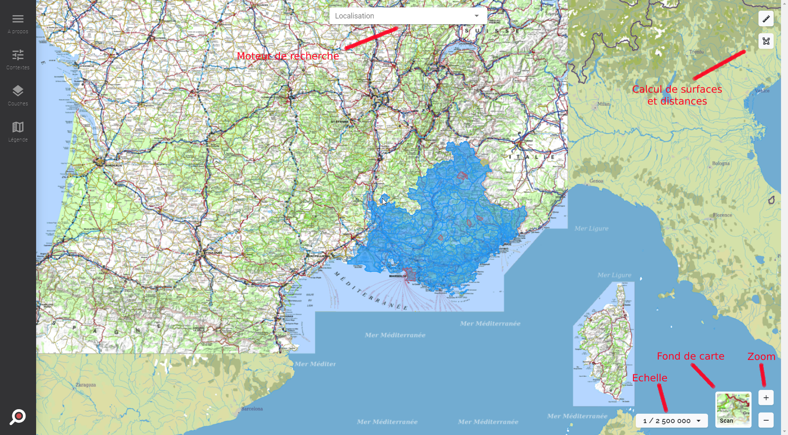

### Outils
- `Echelle`: Sélection rapide de l'échalle de la carte
- `Fond de carte`: Sélection du fond de carte à appliquer
- `Zoom`: Zoomer (+/-) sur la carte
- `Calcul de surface`: Permet de calculer la surface d'un polygone en km²
- `Calcul de distance`: Permet de calculer la distance d'un tronçon en km
- `Moteur de recherche`: Recherche parmi toutes les `Couches cartographiques`, `Actualités`, `Entités cartographiques` et `Infos & règlementations`

### Moteur de recherche

La sélection des éléments trouvés par le moteur de recherche a différentes conséquences selon le type d'élément.

#### Couche Cartographique
Ajoute la couche cartographique au contexte courant et l'affiche sur la carte.

#### Infos & Règlementations
Affiche et zoom sur l'élément sur la carte.
Ouvre le panneau d'informations de l'élément.

#### Actualités
Affiche et zoom sur les communes porteuses de l'actualité sur la carte.
Ouvre le panneau d'informations de l'élément.

#### Entités cartographiques
Affiche et zoom sur l'élément sur la carte.
Ouvre le panneau d'informations de l'élément.

## Contextes
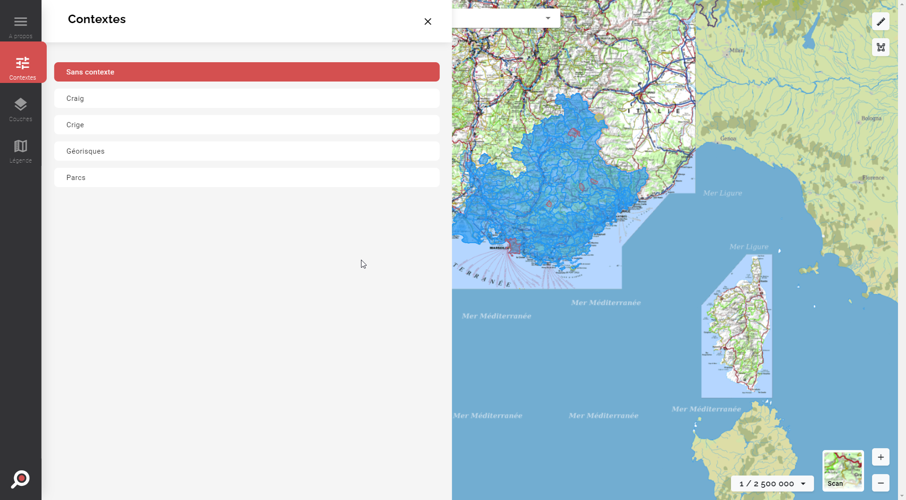

Met en surbrillance le contexte actif parmi la liste des contextes sélectionnables.

### Ajouter un nouveau contexte
L'ajout d'un nouveau contexte ou l'administration de ceux déjà existants se fait par le backoffice d'ORRM.

> Structure > Taxonomie > Preset

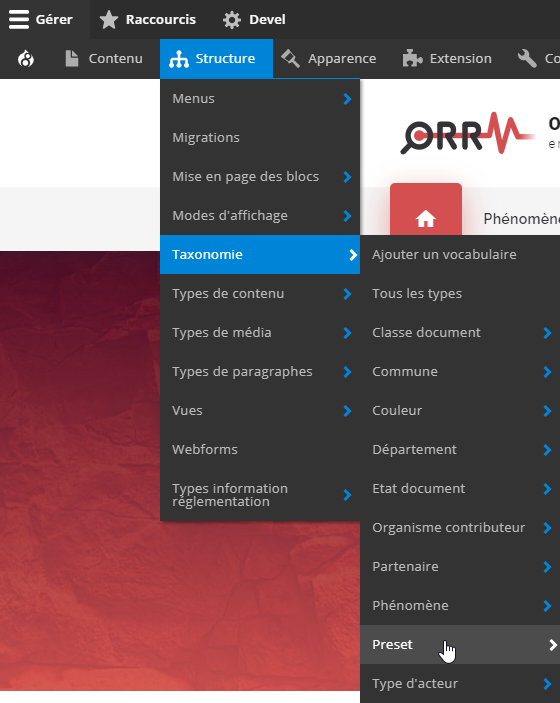

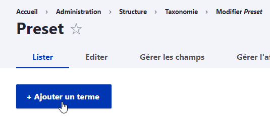

## Couches

### Couches sélectionnées
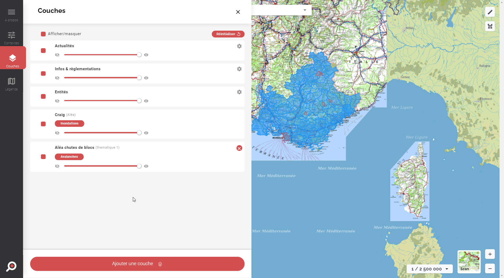

Le panneau de couches affiche les couches sélectionnées.  
Il existe cependant 3 "sous-types" de couches:
- Les éléments de cartographie, constitué des `Actualités`, `Entités cartographiques` et `Infos & règlementations` et reconnaissables par l'icone de roue crantée en haut à droite
- Les couches du contexte, qui ne peuvent pas être retirées
- Les couches ajoutées par l'utilisateur lors de sa navigation, qu'il peut retirer en cliquant sur la croix rouge en haut à droite

Il est possible, pour chacune des couches, de piloter son affichage, son opacité et on ordre d'affichage (en glisser-déposer)

### Catalogue de couches
#### Sélection
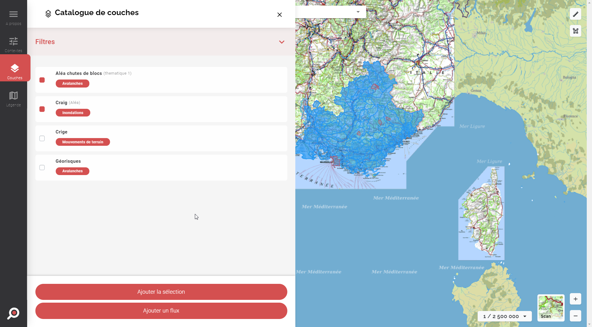

Le panneau "Catalogue de couches" indexe toutes les couches disponibles et permet de les utiliser dans le contexte sélectionné.

#### Ajout de flux WMS
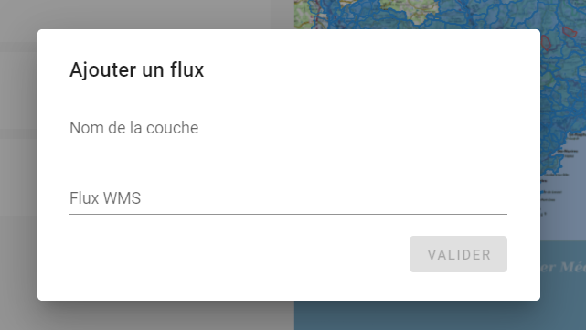

Il est possible d'ajouter son propre flux WMS s'il n'est pas disponible dans le catalogue.

#### Filtrage
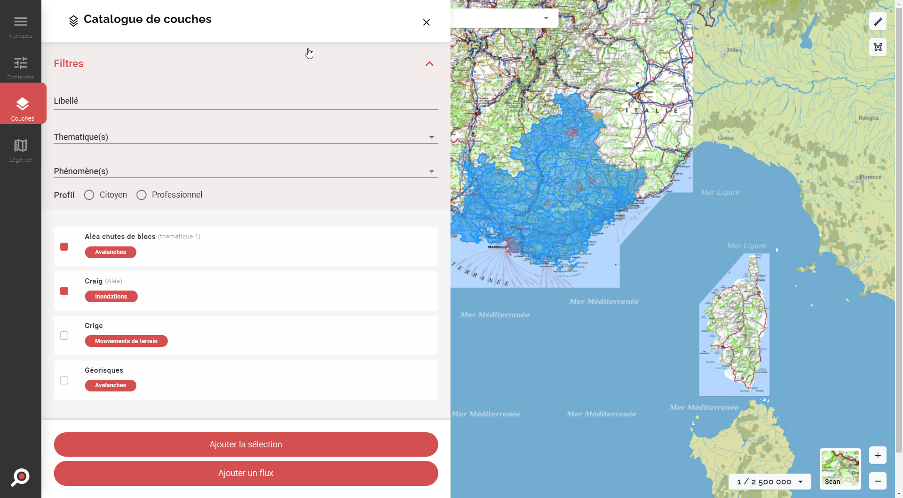

Les couches du catalogue sont filtrables par nom, thématiques, phénomène et profil.

#### Ajouter une couche au catalogue

L'ajout d'un nouvelle couche et l'administration de celles déjà présentes se fait par le backoffice d'ORRM.

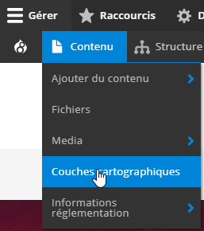
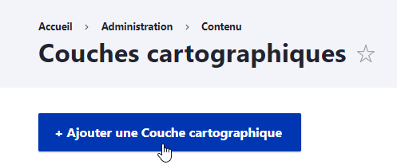

## Légende
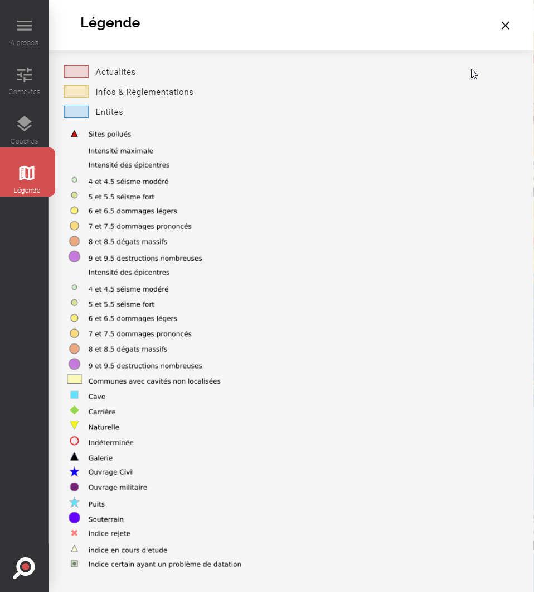

Affiche en permanence les légendes des `Actualités`, `Entités cartographiques` et `Infos & règlementations`.
Affiche les légendes des couches WMS si leur flux en expose.

## A propos
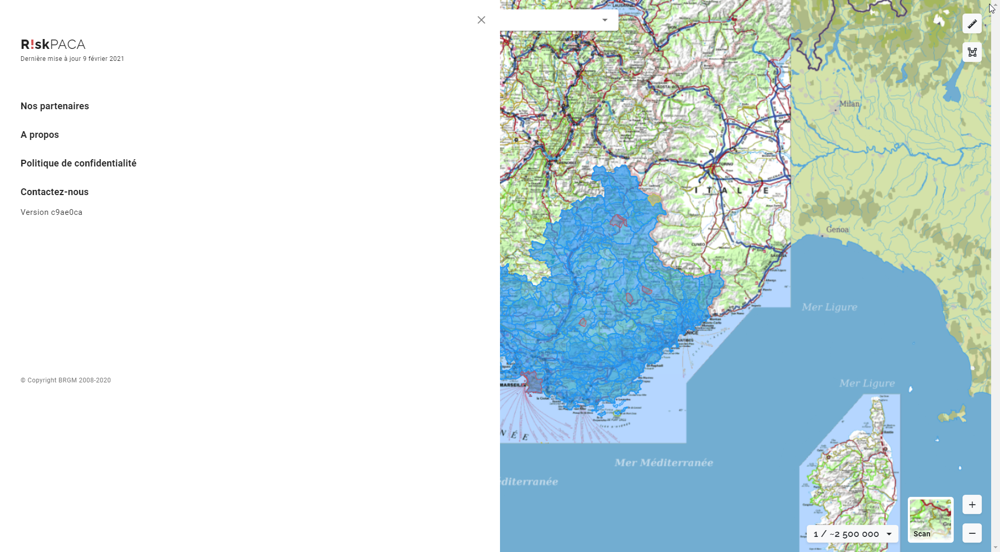

Les liens redirigent vers leurs pages correspondantes sur le site ORRM.

La date de derniere mise à jour et la version sont mis à jour automatiquement.

